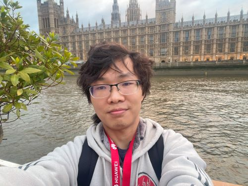

---
# You don't need to edit this file, it's empty on purpose.
# Edit theme's home layout instead if you wanna make some changes
# See: https://jekyllrb.com/docs/themes/#overriding-theme-defaults
layout: home
---

<h1 class="post-title">Xihan Li</h1>

<!-- [Ph.D.](http://www0.cs.ucl.ac.uk/people/Xihan.Li.html)

[Department of Computer Science](http://www.cs.ucl.ac.uk/), [University College London](http://www.ucl.ac.uk/) 

Email: xihan.li at cs dot ucl dot ac dot uk-->

Assistant Professor

[AI³ Institute](https://ai3.fudan.edu.cn/), [Fudan University](https://www.fudan.edu.cn)

Email: <lixihan@fudan.edu.cn>

# Short Bio

I am an assistant professor at the [AI³ Institute](https://ai3.fudan.edu.cn/), [Fudan University](https://www.fudan.edu.cn). My research interests lie in AI for Optimization, focusing on solving challenging real-world optimization problems with the aid of artificial intelligence. I am a [Google Developers Expert](https://developers.google.com/community/experts/directory?hl=zh-cn&text=Xihan%20Li) in Artificial Intelligence. I used to be a research intern in [Jump Trading](https://www.jumptrading.com/), [Huawei Noah's Ark Lab](https://www.noahlab.com.hk/), and [Microsoft Research Asia](https://www.microsoft.com/en-us/research/lab/microsoft-research-asia/). 

Prior to Fudan, I received my Ph.D. degree from [University College London](http://www.ucl.ac.uk/) in 2026, advised by [Prof. Jun Wang](http://www0.cs.ucl.ac.uk/staff/Jun.Wang/). I received my M.S. degree of Computer Science from [Peking University](https://www.pku.edu.cn) in 2019, advised by [Prof. Yunhai Tong](http://www.cis.pku.edu.cn/faculty/system/tongyunhai/tongyunhai.htm). I received my B.Eng. degree of Computer Science with minor certificate of Biological Science from [Zhejiang University](http://www.zju.edu.cn/english). I was a member of [Chu Kochen Honors College (Mixed Class)](http://ckc.zju.edu.cn/ckcen/main.htm).

